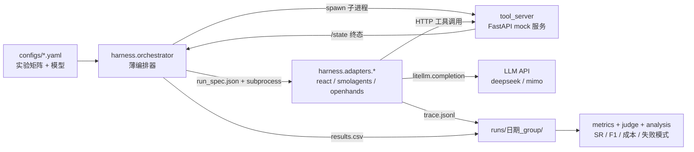

# AgentEval

**轻量、可复现、多框架横向对比的 LLM Agent 评测体系，聚焦多轮工具调用任务。**

> A lightweight, reproducible evaluation harness for **cross-framework comparison** of LLM agents on multi-turn tool-calling tasks — same tasks, same model, different agent frameworks, fully controlled variables.

[](https://www.python.org/)
[](LICENSE)
[](tests/)

---

## 目录

- [项目简介](#项目简介)
- [核心特性](#核心特性)
- [系统架构](#系统架构)
- [快速开始](#快速开始)
- [实验结果](#实验结果)
- [30 分钟复现一组实验](#30-分钟复现一组实验)
- [目录结构](#目录结构)
- [文档](#文档)
- [致谢](#致谢)
- [License](#license)

## 项目简介

现有 Agent 评测方案各有短板：BFCL 等工具调用榜单只覆盖单轮单工具、不考察多轮状态依赖与规划；SWE-bench / WebArena 基础设施过重；τ-bench 封闭且不支持跨框架对比。

AgentEval 在"任务集 — 统一 harness — 多框架适配 — 多指标 — 失败模式分析"五个环节上保持轻量与透明，让 **"同一个任务、同一个模型、不同 Agent 框架"** 的控制变量对比成为可能。

## 核心特性

- **任务集**：40 个多轮工具调用任务（差旅 travel / 电商 shop / 数据查询 analytics × L1/L2/L3 三档难度），全部带**可执行 verifier**（四原语：required_calls / forbidden_calls / final_state_checks / answer_checks）
- **有状态 mock 工具服务**：FastAPI + 确定性数据，18 个工具、权限与业务规则、实例级状态隔离
- **统一评测装置**：薄编排器 + 子进程适配器 CLI 契约（崩溃隔离 / 超时强杀 / 断点续跑），已接入自研 ReAct、smolagents、OpenHands 三个框架
- **指标体系**：任务成功率 SR、工具调用 F1、轨迹分（LLM-as-judge 双评）、成本、延迟
- **验证器自检机制**："空轨迹必 fail / 标准答案必 pass"双向自检，实测识别并修正 11 例评测误判
- **轨迹全量落盘**：JSONL 一行一步，双源采集（服务端工具日志为准 + 适配器消息日志归并）

## 系统架构



类比：评测装置是"测试台"，被评 Agent 框架是"被测发动机"，CLI 契约是统一法兰接口。详见 [docs/ARCHITECTURE.md](docs/ARCHITECTURE.md)。

## 快速开始

```bash
# 环境（uv）
uv venv .venv --python 3.12
uv pip install --python .venv/bin/python -e ".[dev]"

# 单元测试（268 个）+ 任务集双向自检（空轨迹 fail / GT pass）
.venv/bin/python -m pytest
.venv/bin/python -m tasks.validate

# 无 API key 的 dry-run（fake_llm 回放 GT 路径，验证全链路）
EVAL_DRY_RUN=1 .venv/bin/python -m harness.orchestrator \
    --config configs/experiment_matrix.yaml --group R1

# 真实运行（需先 export configs/models.yaml 中对应模型的 api_key_env，
# 如 DEEPSEEK_API_KEY / MIMO_API_KEY）
.venv/bin/python -m harness.orchestrator \
    --config configs/experiment_matrix.yaml --group R1
```

断点续跑：重跑同一 group 自动跳过已完成任务（按 task_id）。

## 实验结果

6 组对照实验（3 框架 × 2 backbone × 40 任务）。完整分析见 [docs/REPORT_FINAL.md](docs/REPORT_FINAL.md)。

| 组 | 框架 | 模型 | SR | 平均耗时 (s) | 平均工具调用 | judge 轨迹分 |
|---|---|---|---|---|---|---|
| R1 | react | deepseek-v4-flash | **0.975** | **10.2** | **2.4** | 4.39 |
| S1 | smolagents | deepseek-v4-flash | 0.95 | 20.5 | 8.5 | 4.34 |
| R2 | react | mimo-v2.5-pro | 0.95 | 37.7 | 2.4 | 4.72 |
| S2 | smolagents | mimo-v2.5-pro | 0.90 | 63.5 | 3.2 | 4.34 |
| O1 | openhands | deepseek-v4-flash | 0.90 | 8.8 | 2.8 | 4.35 |
| O2 | openhands | mimo-v2.5-pro | 0.925 | 26.1 | 2.8 | 4.47 |

核心结论：

- 自研 ReAct 以最少调用（2.4 次/任务）、最低耗时达到最高 SR；smolagents 同等水平需 3.5 倍调用、约 4.7 倍 token
- 全部六组工具调用 Precision 恒为 1.0（无一非法调用或畸形参数）
- 发现 OpenHands 的提示体系会系统性削弱模型的答案过滤纪律——同一模型仅换框架即由通过变失败

## 30 分钟复现一组实验

1. **装依赖**：`uv venv .venv --python 3.12 && uv pip install --python .venv/bin/python -e ".[dev]"`
2. **配置模型 key**：`export DEEPSEEK_API_KEY=...` 或 `export MIMO_API_KEY=...`（见 `configs/models.yaml` 各条目 `api_key_env`）
3. **跑一组实验**：`.venv/bin/python -m harness.orchestrator --config configs/experiment_matrix.yaml --group R1`（约 15~40 分钟，产出 `runs/<日期>_R1/`）
4. **看结果**：
   - 汇总指标：`.venv/bin/python -m metrics.aggregate runs/<日期>_R1`
   - 失败分布：`.venv/bin/python -m analysis.failure_modes runs/<日期>_R1`
   - 自动报告：`.venv/bin/python -m analysis.report runs/<日期>_R1 -o 报告.md`
   - 离线复评：`.venv/bin/python -m analysis.reevaluate runs/<日期>_R1`
   - LLM-as-judge 评分：`.venv/bin/python -m judge.judge runs/<日期>_R1 --judge-models deepseek-v4-flash,deepseek-v4-flash`
   - Dashboard：`.venv/bin/python -m streamlit run dashboard/app.py`

产出目录 `runs/<日期>_<group>/`：`config.yaml`（配置快照）、`traces/{task_id}.jsonl`（轨迹）、`results.csv`、`summary.json`、`failure_modes.json`、`judge_scores.json`。

## 目录结构

```
├── configs/        # 实验矩阵与模型配置
├── tasks/          # 40 任务（三域）+ 声明式 verifier + 双向自检
├── tool_server/    # FastAPI 有状态 mock 工具服务（18 工具）
├── harness/        # 薄编排器 + 进程间契约 + 三框架适配器（react/smolagents/openhands）
├── metrics/        # SR / 工具调用 F1 / 成本延迟 / 汇总
├── judge/          # LLM-as-judge（双评 + 一致性 + 兜底）
├── analysis/       # 失败模式分类 / 报告生成 / 离线复评
├── dashboard/      # Streamlit：总览 / 轨迹回放 / 失败分析
├── tests/          # 268 个单元测试
└── docs/           # 架构说明 / 实验报告 / 案例研究
```

## 文档

- [项目方案.md](项目方案.md) —— 完整项目方案（任务集 / mock 服务 / harness / 指标 / judge / 实验设计）
- [任务设计指南.md](任务设计指南.md) —— 任务样本设计方法论（难度维度、陷阱库、自检清单）
- [docs/ARCHITECTURE.md](docs/ARCHITECTURE.md) —— 架构说明与进程间契约
- [docs/REPORT_FINAL.md](docs/REPORT_FINAL.md) —— 最终实验报告（主表 / 分难度 / 失败模式 / 归因）
- [docs/CASESTUDY.md](docs/CASESTUDY.md) —— 6 例轨迹案例研究

## 致谢（设计灵感）

[τ-bench](https://github.com/sierra-research/tau-bench)（verifier 判定模式）、[Berkeley BFCL](https://gorilla.cs.berkeley.edu/leaderboard.html)（参数校验）、[SWE-bench](https://github.com/princeton-nlp/SWE-bench)（报告结构）、tool-eval-bench、[langchain-ai/agentevals](https://github.com/langchain-ai/agentevals)、hodoscope。

## License

[MIT](LICENSE)
