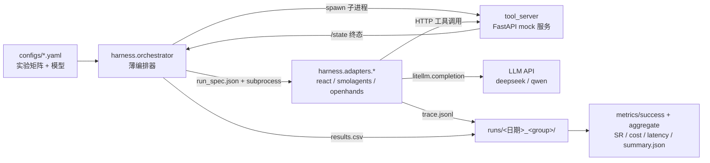

# AgentEval 架构说明

> 配套《项目方案.md》§6。本文档描述评测装置的组件关系与数据流。

## 术语

| 术语 | 含义 | 本项目实例 |
|---|---|---|
| Agent harness（被评对象） | 运行 Agent 的框架/运行时 | 自研 ReAct、smolagents、OpenHands |
| Evaluation harness（评测装置） | 把被评 Agent 架到任务集上运行的脚手架 | `harness/`（薄编排器 + 适配器） |

类比：评测装置是"测试台"，被评 Agent 框架是"被测发动机"，CLI 契约是统一法兰接口。

## 组件图



## 进程间契约（唯一权威：`harness/protocol.py`）

1. **run_spec.json**（编排器生成、适配器只读）：run_id、task（goal/difficulty/initial_state）、tool_specs（来自 `tool_registry.json`）、tool_server 地址、模型与端点、model_params、budget。dry-run 模式额外注入 `gt_plan`/`gt_answer`。
2. **trace.jsonl**（适配器产出）：一行一步（message/tool_call/observation），末行 final_answer 汇总（status/wall_time_s/total_cost_usd）。
3. **退出码**：`0` 正常结束（含答案错误）；`1` 运行错误；`2` 预算/超时。任何分支都必须写出 trace。

## 适配器 CLI 契约（§6.3）

```bash
python -m harness.adapters.<name> --spec run_spec.json --out trace.jsonl
```

归一化责任下放到适配器（共享 `harness.protocol` 数据类），编排器不感知任何框架细节。

## 复现性保障（§6.7）

- 配置集中在 `configs/*.yaml`；每次运行快照 `runs/<日期>_<group>/config.yaml`
- `run_id = {group}__{task_id}`，结果行已存在即跳过（断点续跑）
- mock 服务确定性：同一 (instance, tool, args) 永远同一结果；实例间状态深拷贝隔离

## 文件所有权约定（并行开发契约）

| 目录/文件 | 职责 |
|---|---|
| `harness/protocol.py` | 数据契约（主控维护，其余模块只读使用） |
| `tool_server/` | mock 工具服务（读 `tool_registry.json` 作为唯一数据源） |
| `harness/adapters/react.py` | 自研 ReAct 适配器（实现 CLI 契约） |
| `harness/orchestrator.py` | 薄编排器（子进程调度/预算/断点续跑） |
| `metrics/` | 判定与指标（success/cost_latency/aggregate） |
| `tasks/verifiers.py` | 声明式 verifier 引擎（四原语判定） |
